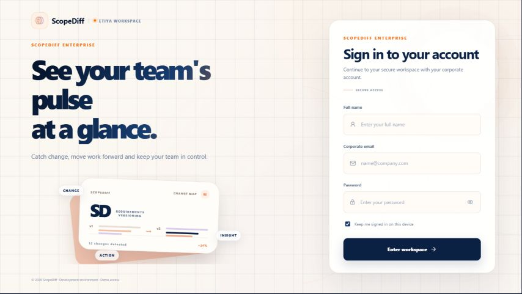
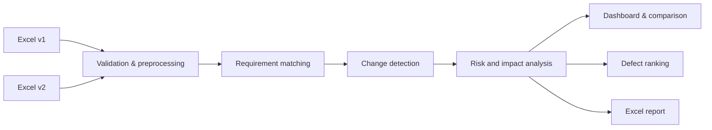

# ScopeDiff AI

> **Turn requirement changes into clear decisions.**
>
> Because one small sentence can become a very large defect.

ScopeDiff AI is an AI-assisted requirement comparison and change intelligence platform. It compares two versions of Excel-based requirement documents, explains what changed, highlights potentially risky updates, and helps teams investigate which changes may be related to a reported defect.

The goal is simple: replace hours of manual document review with a focused view of the changes that deserve attention first.

## Product preview



## Why ScopeDiff AI?

Requirement documents evolve constantly. A changed number, a new obligation, a removed condition, or a subtle wording difference can affect development, testing, and production behaviour.

ScopeDiff AI brings these signals together in one workflow:

- **What changed?** Added, removed, and semantically changed requirements.
- **How did it change?** Numeric, duration, condition, scope, obligation, and negation changes.
- **How important might it be?** A risk profile based on measurable change signals.
- **Could it be related to a defect?** Candidate changes ranked against a defect description.
- **What should happen next?** Analyst questions and test suggestions to support investigation.

## Core capabilities

### Intelligent document comparison

- Upload previous and current Excel requirement versions.
- Match related requirements using TF-IDF and Sentence Transformer-based semantic similarity.
- Detect changes even when the wording is not identical.
- View old and new requirement text side by side.

### Change and risk intelligence

- Classify additions, removals, and modified requirements.
- Detect changes in numbers, durations, conditions, scope, obligations, and negations.
- Surface contradictions and meaningful semantic differences.
- Group changes into a risk profile so analysts can focus their review.

### Defect investigation

- Enter a defect description.
- Rank historical requirement changes by their semantic relationship to the defect.
- Use the ranking as an investigation guide—not as an automatic root-cause verdict.

### Team workflow and reporting

- Track process items, owners, team leads, and statuses.
- Review analysis history and requirement versions.
- Explore results through dashboards and detailed comparison views.
- Export analysis results as an Excel report.

## How it works



1. The user uploads two versions of a requirement document.
2. The backend validates the files and standardizes the requirement text.
3. Matching modules pair semantically related requirements.
4. The analysis layer identifies the type and meaning of each change.
5. Risk and impact signals are calculated for prioritization.
6. Results are displayed in the web interface and can be exported.

## Technology stack

| Layer | Technologies |
| --- | --- |
| Frontend | React, TypeScript, Vite, Recharts, Lucide React |
| Backend | Python, FastAPI, Pydantic, Uvicorn |
| NLP and analysis | Sentence Transformers, scikit-learn, Pandas, regular expressions |
| Data and reporting | SQLite, SQLAlchemy, OpenPyXL |
| Testing | Pytest |

## Project structure

```text
scopediff-ai/
├── backend/
│   └── app/
│       ├── comparison/       # Requirement matching and change detection
│       ├── defects/          # Defect-to-change ranking
│       ├── history/          # Version history
│       ├── insights/         # Impact and contradiction analysis
│       ├── matching/         # TF-IDF and semantic matching
│       ├── pipeline/         # End-to-end analysis flow
│       ├── reports/          # Excel report generation
│       └── risk/             # Risk scoring
├── dataset/                  # Synthetic evaluation datasets
├── docs/                     # Architecture and project documentation
├── experiments/              # Model and ranking experiments
├── frontend/                 # React application
├── sample_files/             # Example Excel inputs
└── tests/                    # Automated tests
```

## Getting started

### Prerequisites

- Python 3.10 or newer
- Node.js 18 or newer
- npm

### 1. Start the backend

From the project root:

```bash
python -m venv .venv
```

Activate the environment and install the backend dependencies.

**Windows PowerShell**

```powershell
.venv\Scripts\Activate.ps1
pip install -r backend\requirements.txt
python -m uvicorn backend.app.main:app --reload --port 8000
```

**macOS/Linux**

```bash
source .venv/bin/activate
pip install -r backend/requirements.txt
python -m uvicorn backend.app.main:app --reload --port 8000
```

The API is available at `http://127.0.0.1:8000` and its interactive documentation is available at `http://127.0.0.1:8000/docs`.

### 2. Start the frontend

Open a second terminal:

```bash
cd frontend
npm install
npm run dev
```

Open the address shown by Vite, normally `http://127.0.0.1:5173`.

### 3. Try the sample files

Example inputs are available in [`sample_files/`](sample_files/):

- `requirements_v1.xlsx`
- `requirements_v2.xlsx`
- `requirements_v3.xlsx`
- `defects.xlsx`
- `process_tracking_sample.xlsx`

The backend creates the SQLite database automatically at `backend/scopediff.db` when the application starts.

## Development commands

```bash
# Frontend production build
cd frontend
npm run build

# Frontend linting
npm run lint

# Backend and project tests
cd ..
python -m pytest -q
```

## Data privacy

ScopeDiff AI is designed for synthetic and publicly shareable data. The repository does not include real customer data, confidential company documents, proprietary APIs, or internal business information.

Before using the project with real documents, review the deployment architecture, authentication model, access controls, and data-retention requirements for your organization.

## Project status

ScopeDiff AI is an active prototype and academic project. The core comparison, semantic matching, defect-ranking, reporting, history, and team workflow capabilities are available for demonstration and continued development.

## Documentation

- [System architecture](docs/architecture.md)
- [Project scope](docs/project_scope.md)
- [Data schema](docs/data_schema.md)

## License

This project is released under a proprietary commercial license.

Copyright (c) 2026 Gamze Nur Aslan. All rights reserved.

The software, source code, design, documentation and related materials may
not be copied, modified, distributed, sublicensed, reverse engineered or used
commercially without prior written permission. Commercial use requires a
separate written agreement. See [LICENSE](LICENSE) for the full terms.
